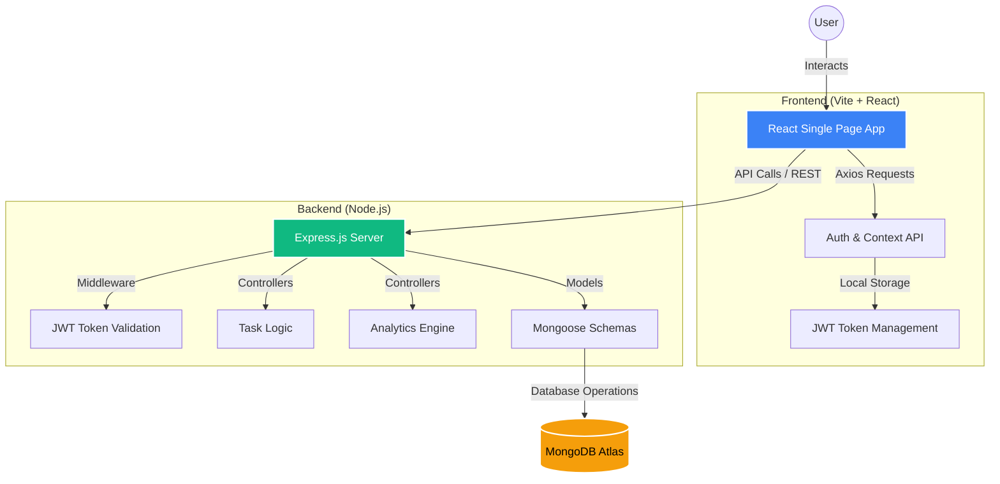

# TaskVerse

TaskVerse is a professional, high-performance task management and collaborative analytics platform. It empowers users and teams to manage tasks, track productivity through advanced analytics, and engage in gamified competition via leaderboards.

---

## 🚀 Key Features

-   **🔐 Secure Authentication**: Robust JWT-based authentication for secure user sessions and data protection.
-   **📅 Collaborative Task Management**: Seamlessly create, assign, and track tasks within groups or individually.
-   **📊 Advanced Analytics**: Visualize productivity trends and task completion metrics through a dedicated analytics dashboard.
-   **🏆 Gamified Leaderboard**: Boost team productivity with a competitive leaderboard based on task performance.
-   **👥 Group Workspaces**: Create and manage groups for collaborative project management.
-   **🎨 Dynamic UI/UX**: Ultra-modern, responsive interface with Dark Mode support and mesh gradients, built with React and Tailwind CSS.
-   **🛡️ Audit Logs**: Track changes and maintain accountability across the workspace.

---

## 🏗️ Architecture & Workflow

TaskVerse follows a modern full-stack architecture with a decoupled frontend and backend.



---

## 🛠️ Tech Stack

-   **Frontend**: React.js, Vite, Tailwind CSS, Axios, Lucide React, Framer Motion.
-   **Backend**: Node.js, Express.js.
-   **Database**: MongoDB (Mongoose ORM).
-   **Authentication**: JSON Web Tokens (JWT).
-   **DevOps**: Vercel (Deployment), Mongodb-Memory-Server (Local Testing).

---

## ⚙️ Local Setup Guide

### Prerequisites
-   [Node.js](https://nodejs.org/) (v16+ recommended)
-   [MongoDB](https://www.mongodb.com/) (Local or Atlas)

### 1. Clone the Repository
```bash
git clone https://github.com/your-username/TaskVerse.git
cd TaskVerse
```

### 2. Backend Configuration
1. Navigate to the backend directory:
   ```bash
   cd backend
   ```
2. Install dependencies:
   ```bash
   npm install
   ```
3. Create a `.env` file in the `backend/` folder:
   ```env
   PORT=5001
   MONGODB_URI=your_mongodb_connection_string
   JWT_SECRET=your_super_secret_key
   FRONTEND_URL=http://localhost:5173
   ```
4. Start the server:
   ```bash
   npm run dev
   ```

### 3. Frontend Configuration
1. Navigate to the frontend directory:
   ```bash
   cd ../frontend
   ```
2. Install dependencies:
   ```bash
   npm install
   ```
3. Create a `.env` file in the `frontend/` folder:
   ```env
   VITE_API_URL=http://localhost:5001
   ```
4. Start the development server:
   ```bash
   npm run dev
   ```

---

## 🌐 Deployment Guide (Vercel)

TaskVerse is optimized for deployment on **Vercel**. Since the project consists of a separate frontend and backend, follow these steps:

### 1. Deploy the Backend
1. In the Vercel Dashboard, click **Add New** > **Project**.
2. Import the repository and set the **Root Directory** to `backend`.
3. Set the **Framework Preset** to `Other` (Vercel will detect `server.js` via `vercel.json`).
4. Add the following **Environment Variables**:
   - `MONGODB_URI`: Your MongoDB Atlas connection string.
   - `JWT_SECRET`: Your production secret key.
   - `FRONTEND_URL`: The URL of your deployed frontend (you may need to update this after deploying the frontend).
5. Click **Deploy**.

### 2. Deploy the Frontend
1. In the Vercel Dashboard, click **Add New** > **Project** again.
2. Import the repository and set the **Root Directory** to `frontend`.
3. The **Framework Preset** should be automatically detected as `Vite`.
4. Add the following **Environment Variables**:
   - `VITE_API_URL`: The URL of your deployed backend (from Step 1).
5. Click **Deploy**.

---

## 📂 Project Structure

```text
TaskVerse/
├── backend/                # Express server and API logic
│   ├── controllers/        # Request handlers
│   ├── models/             # Mongoose schemas
│   ├── routes/             # API endpoints
│   ├── middleware/         # Auth & validation guards
│   └── server.js           # Entry point
├── frontend/               # React application
│   ├── src/
│   │   ├── components/     # Reusable UI components
│   │   ├── pages/          # Full-page views
│   │   ├── context/        # State management (Auth, Theme)
│   │   └── App.jsx         # Routing & main logic
│   └── public/             # Static assets
└── README.md
```
note : this project is fully vibe coded, unlike others
